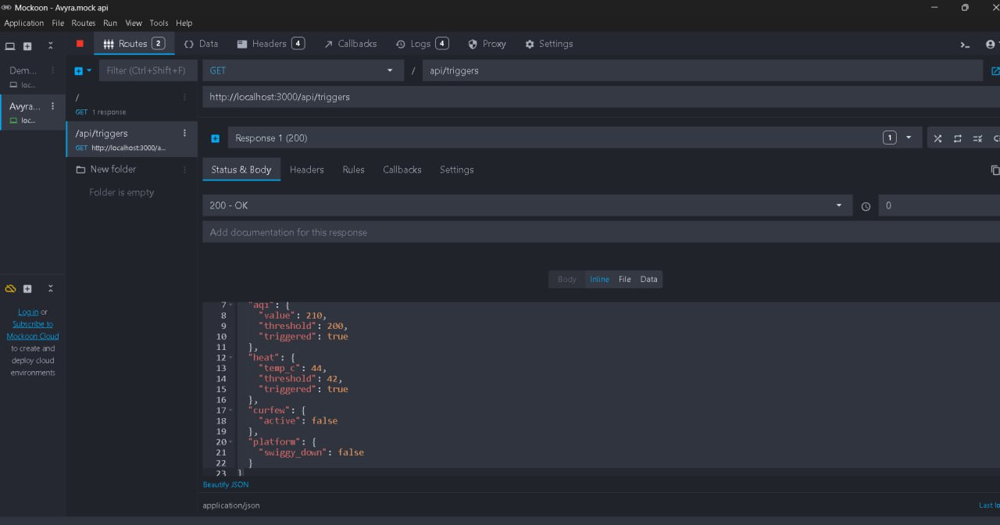

# 🚀 AVYRA — INCOME STABILITY ENGINE FOR GIG WORKERS  

## 🎥 DEMO VIDEO  

👉 https://www.loom.com/share/311bbd16e3874b758b317d65a879fb3b  
👉 Phase 2 Demo: https://www.loom.com/share/43ba6dcb7b814295963d27b18a990855  

---

# 📌 ABOUT AVYRA  

AVYRA is an **Income Stability Engine** that predicts disruptions, guides gig workers to earn before impact, and dynamically insures only the remaining income loss.  

---

# 💡 CORE IDEA  

## ❌ TRADITIONAL INSURANCE  
- Claim after loss  
- Fixed premiums  
- Manual process  

## ✅ AVYRA  
- Predicts disruptions  
- Guides workers proactively  
- Covers only remaining loss  
- Fully automated system  

---

# 🧩 PHASE 1: CORE SYSTEM  

## 🔐 WORKER REGISTRATION  
- Name, phone, city  
- Platform selection  
- Daily earnings input  
- Risk zone selection  

---

## 💰 DYNAMIC PREMIUM CALCULATION  
Final Premium = Base × Zone × Season × Stability

---

# ⚡ PHASE 2: AUTOMATION & PROTECTION  

## 🤖 AUTOMATED TRIGGERS  
- Rain > 40mm/hr  
- Heatwave > 42°C  
- AQI > 400  

---

# 📡 MOCK API (PROOF)  

---

# 💥 DYNAMIC PAYOUT  

---

# 🖥️ TECH STACK  

- React  
- Node.js  
- Supabase  
- Mockoon  

---

# 👥 TEAM  

- Lohitha  
- Shanti  
- Kamakshi  
- Charvi  
- Jyostnavi
  # 🚀 AVYRA — INCOME STABILITY ENGINE  
### ⚡ SMART • AUTOMATED • PREDICTIVE
